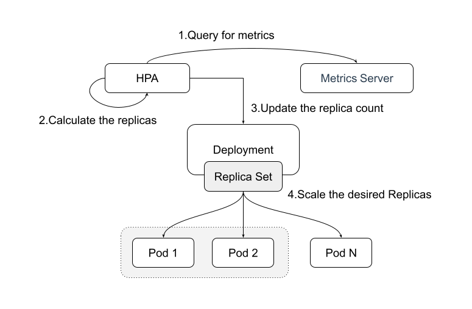

# Autoscaling

The concept of elastic scalability refers to utilizing the functionality of cloud computing to dynamically adjust resources based on fluctuations in business demand. In summary, the significance of elastic scalability can be described as follows:

- Peak load handling: Scaling resources rapidly based on demand during promotional campaigns, holiday shopping seasons, or unexpected events to ensure application availability and performance.
- improve resources utilization: dymanically adjust resources based on the actual loading, avoid the waster of infrastructure resource, reduce TCO(Total cost of ownership).
- dealing with breakdown and fault-tolerant: deploy multiple instance and rapidly replacement to enhance business continunity and avaliability.
- Adapting to demand changes: Matching front-end business requirements and pressures, swiftly adjusting scales to enhance event handling capabilities, meeting needs, and expectations.

## Horizontal Pod Autoscaling

Kubernetes itself offers a mechanism for elastic scaling, including the Vertical Pod Autoscaler (VPA) and Horizontal Pod Autoscaler (HPA). HPA adjusts the number of pod replicas controlled by a controller based on CPU and memory utilization, functioning as a feature to scale resources up or down.

HPA relies on Metrics-Server to capture CPU and memory data for resource usage metrics and can also scale based on custom metrics such as Prometheus.

<div  align="center">
	
</div>

From the above image, it is evident that HPA continuously monitors Metrics-Server metrics, calculates the required number of replicas based on this data, and dynamically adjusts resource replicas to achieve horizontal scaling to meet the set target resource values.

The following example creates an HPA (Horizontal Pod Autoscaler) with an expected CPU utilization of 70%. The replica range is between 1 and 10, targeting the Deployment named 'nginx-deployment'.

```plain
apiVersion: autoscaling/v2beta1
kind: HorizontalPodAutoscaler
metadata:
  name: scale
  namespace: default
spec:
  maxReplicas: 10                    # The maxium replicas of target resources
  minReplicas: 1                     # The minium replicas of target resources
  metrics:                           # The metric indicates an expected CPU utilization rate of 70%.
  - resource:
      name: cpu
      targetAverageUtilization: 70
    type: Resource
  scaleTargetRef:                    # target resource
    apiVersion: apps/v1
    kind: Deployment
    name: nginx-deployment
```

There is limits using HPA to do resource scalling:

- No external metric support. Applications on the business end can vary significantly in terms of changes and dependencies beyond just CPU and memory scaling, such as different event sources, middleware/applications, etc.
- Unable to go from 1 to 0. Are workloads supposed to be non-operational when the application experiences zero load?

Here is the Kubernetes-based Event-Driven Autoscaling（KEDA）！

## Using event driver: Keda to implement elastic scaling

The built-in HPA (Horizontal Pod Autoscaler) in Kubernetes supports only limited metrics such as CPU/MEM. However, in reality, these metrics might not always represent the actual load on a service. For instance, in the case of a message server, if there's a significant message backlog, one might want to scale up the number of consumers handling messages. In such scenarios, Keda can be utilized.

KEDA is an event-driven autoscaling tool based on Kubernetes. Through KEDA, we can scale any container in Kubernetes based on the number of events that need to be processed.