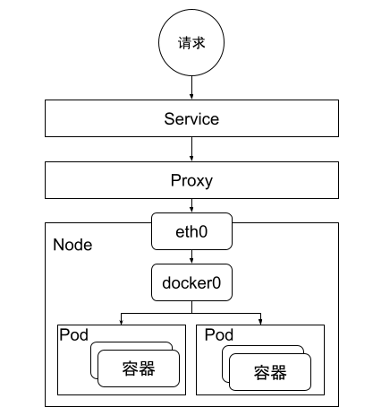

# Kubernetes CNI

Before introducing the CNI specifications, let's first understand the definition of the network model within a Kubernetes cluster.

- Each Pod has its own unique IP address, and all containers within the Pod share a common network namespace.
All Pods within the cluster reside in a flat network that allows direct communication without requiring NAT for accessing nodes and containers.
- The Service Cluster IP is accessible within the cluster. External requests require access through NodePort, LoadBalancer, or Ingress to reach it.

	

The Container Network Interface (CNI) is a CNCF (Cloud Native Computing Foundation) project that defines a set of specifications for Linux container networking interfaces. It also encompasses various plugins and implementation libraries.

Kubernetes itself doesn't implement the network model within the cluster. Instead, it abstracts and provides the CNI interface for third-party implementations. This approach conserves development resources, allowing them to focus on enhancing Kubernetes itself. Moreover, it harnesses the collective power of the open-source community to build a rich ecosystem around it.

Kubernetes 并不关心各个 CNI 如何具体实现上述基础规则，只要最终的网络模型符合标准即可。因此我们可以确保不论使用什么 CNI，Kubernetes 集群内的 Pod 网络都是一张巨大的平面网络，每个 Pod 在这张网络中地位是平等的，这种设计对于集群内的服务发现、负载均衡、服务迁移、应用配置等诸多场景都带来了极大的便利。
kubernetes doesn't care about how a CNI implements the base rule mentioned abrove, as long as it match the eventual standard of netword model.As a result we are able to ensure no matter what CNI we use, the network within the k8s cluster is a huge flat networking and each pod's rules in this network is equal.This design brings a lot convenience for the senerio of service discovery, loadbalance, service migrate, application configuration within the cluster.

Kubernetes isn't concerned about the specific implementation details of each CNI regarding the foundational rules mentioned earlier. As long as the final network model adheres to the standards. Thus, regardless of the CNI used, the Pod network within a Kubernetes cluster forms a unified flat network. Each Pod holds an equal status within this network. Such a design significantly facilitates various scenarios within the cluster, including service discovery, load balancing, service migration, application configuration, and more.

## CNI design idea

The basic approach in CNI design involves the creation of a network namespace by the container runtime. Subsequently, CNI plugins take charge of network configuration, culminating in the launch of applications within the container. CNI defines two primary plugins: the CNI plugin responsible for network configuration, and the IPAM plugin handling container address allocation. Let's delve into the application of these two plugins using container startup as an example.

- Before starting the containers, `kubelet` initiates a Pause container.
- A network namespace is created before the Pause container starts.
- If kubelet is configured with CNI, it will invoke the corresponding CNI plugin.
- The CNI plugin performs network configuration tasks, such as creating virtual network interfaces and joining the network namespace.
- CNI invoke ipam to allocate adadress
- Start other containers within the Pod and share the network namespace created by the Pause container.

## CNI plugin's network solution

The current mainstream solutions for CNI plugins include the following:

- Layer 2 Interconnect: This method combines with traditional VLANs.In the need for configuring VLAN information on network hardware, making it less manageable. Moreover, it has scalability limitations and isn't suitable for cross-data center connectivity. However, it offers lower network overhead and is suitable for small-scale cluster deployments.

- The three-layer routing, mainly relies on BGP and other three-layer routing protocols to complete the routing transmission. The advantage of this solution is that it has a higher transmission rate and does not require packet encapsulation and decapsulation. However, BGP and other protocols are supported within many data centers, making the setup more complicated.

- The Overlay solution, primarily utilizing VXLAN or ipip overlay protocols, enables interoperability among containers. This approach has the advantage of enabling network interconnection across different data centers. However, it also has the disadvantage of adding computational overhead and network latency due to packet encapsulation and decapsulation.

- The SDN solution, primarily utilizing an SDN controller in combination with virtual network switches such as ovs, is used to facilitate data forwarding. The advantage of this approach is that the network can be customized as needed, while the disadvantage is its complexity.