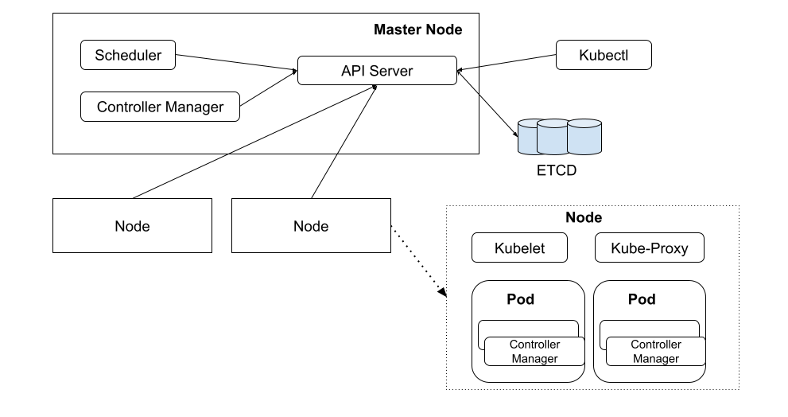

# 8.3 Kubernetes System architecture

Kubernetes is a typical master-slave architecture. It consists of two parts: the manager, called Control Plane, and the managed, called Node

	
	
Feature Kubernetes Architecture

## 1. Control Plane

The Control Plane is the cluster manager, logically represented as a single entity. According to convention, we can also refer to this computer as the Master node. The Control Plane manages nodes uniformly, schedules resources, and operates Pods. Its objective is to ensure that various Kubernetes objects created by users run according to the state described in their configurations. It includes the following components:

- API Server: This is the application interface that operates various resources within Kubernetes. It provides mechanisms for authentication, authorization, access control, API registration, and discovery among other functionalities.

- Scheduler: Responsible for scheduling Pods onto suitable Nodes. For instance, after a Pod is created through the API Server, the Scheduler employs scheduling policies to find a suitable Node for deployment..

- Controller Manager: Responsible for executing management operations within the cluster. For instance, it manages the expected addition or deletion of Pods and initiates a sequence of Pods according to a predefined order.

## 2. Node

The Node, commonly referred to as a worker node, can be multiple in number and is used to run Pods. It manages individual Pods based on commands from the Control Plane. It includes the following components:

- Kubelet: It's the agent that runs on the Node in Kubernetes, responsible for managing the entire lifecycle of Pods on that Node, including creation and termination.

- Within Kubernetes, Kube-proxy abstracts a specific set of Pods as a Service. It provides intra-cluster service discovery and load balancing for Services by maintaining network rules on the node.

- Container runtime: It is responsible for running Pods and their internal containers. In earlier chapters, various types of container runtimes were introduced. Kubernetes supports multiple container runtimes such as containerd, Docker, and others.

