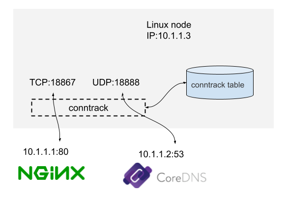
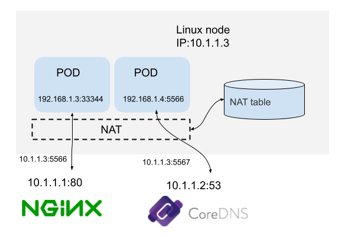
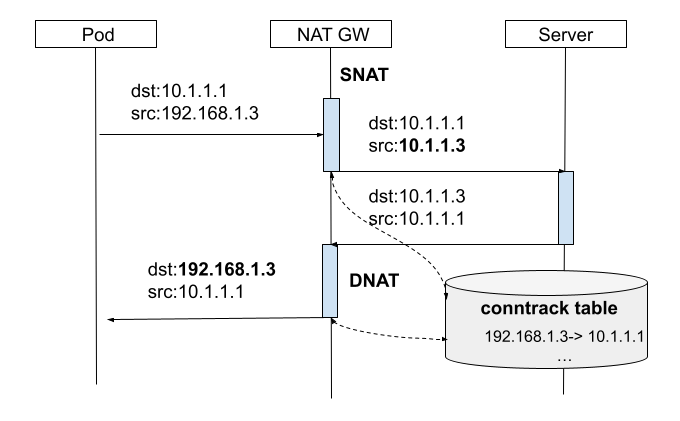

# 3.2.2 Connection conntrack

Connection tracking (Conntrack, CT) tracks and records the connection status.As shown in Figure 3-11, this is a Linux machine with an IP address of 10.1.1.3. We can see that there are two connections on this machine:


-The machine access to the external HTTP service connection (destination port 80).
-The machine access to the connection of external DNS services (destination port 53).

<div  align="center">
	
	<p>Figure 3-11 Conntrack Example</p>
</div>

What the connection tracking does is to discover and track the state of these connections, including:

- Colon the information from the data packet to distinguish the data flow and the corresponding connection.
- The connection to maintain a state database (Conntrack Table), such as the creation time, the number of packages, the number of bytes of the sending, and so on.
- Catched expired connection (GC).
- Suply for more upper -level functions (such as NAT).

## 1. conntrack principle

When loading the kernel module NF_Conntrack, the Conntrack mechanism began to work. According to Figure 3-3 "Packet Flow in Netfilter and General Networking", the Conntrack (elliptical frame) has two places (Prerouting and Output and Output. Front)Can track the data packet.

each of the Conntrack data packet, the kernel generates a Conntrack entry for it to track this connection. For subsequent packets, the kernel will determine that if this data packet belongs to a existing connection, the corresponding Conntrack entry will update the status (such as the update to the ESTABLISHED state), otherwise the kernel will create a new Conntrack entry for it.All Conntrack entries are stored in a table, called connection tracking table.

The connection tracking table is stored in the system memory. You can use the cat /proc/net/nf_conntrack command to view all the currently tracking entries. All the information maintained by Conntrack is included in this entry. You can know what a connection is in.

The following is a TCP connection that indicates a state of ESTABLISHED.
```plain
$ cat /proc/net/nf_conntrack
ipv4     2 tcp      6 88 ESTABLISHED src=10.0.12.12 dst=10.0.12.14 sport=48318 dport=27017 src=10.0.12.14 dst=10.0.12.12 sport=27017 dport=48318 [ASSURED] mark=0 zone=0 use=2
```

## 2. conntrack Application example 

Connection tracking is the basis of many network applications. Common use scenarios such as NAT (Network Address Translation, network address conversion), iPtables status matching, etc.

As shown in Figure 3-12, the machine's own IP 10.1.1.3 can communicate with the external normal, but the 192.168 network segment is a private IP section, which cannot be accessed outside.As a result:

- When packets with a source address in the 192.168 network need to go out, the machine will first replace the source IP with its own IP address, 10.1.1.3, before sending them out, performing SNAT (Source Network Address Translation) on the source address
- When received response package, perform the reverse transformation, conducting DNAT (destination network address translate)

<div  align="center">
	
	<p>Figure 3-12</p>
</div>

When the NAT gateway receives a request packet from the internal network, it performs SNAT and simultaneously stores this connection's details in the connection tracking table. Upon receiving the response packet, it refers to the connection tracking table to determine the destination host, and then carries out DNAT. DNAT + SNAT together essentially constitute Full NAT. as illustrated in Figure 3-13.
<div  align="center">
	
	<p>Figure 3-13 FullNAT</p>
</div>

When setting up Kubernetes, there is a configuration parameter net.bridge.bridge-nf-call-iptables = 1 that many students are unclear about. Here, the author, in conjunction with conntrack, explains the purpose of this configuration.

The essence of a Kubernetes Service is a reverse proxy. When accessing a Service, DNAT (Destination Network Address Translation) occurs, transforming the packets initially destined for ClusterIP:Port into the IP and Port of a specific Endpoint within the Service (PodIP:Port). Subsequently, the kernel inserts connection information into the conntrack table to log the connection. Upon receiving response packets from the destination, the kernel matches the connection in the conntrack table and performs reverse NAT, allowing the return path to form a complete connection pathway.


However, a Linux bridge operates as a virtual Layer 2 forwarding device, while iptables conntrack functions at Layer 3. Therefore, direct access to addresses within the same bridge leads to Layer 2 forwarding without traversing conntrack. Due to the absence of a return path, communication between the client and server doesn't occur on the same "channel." Without recognizing themselves as part of the same connection, they're unable to communicate properly.

Enabling the bridge-nf-call-iptables kernel parameter (setting it to 1) indicates that the bridge device, during Layer 2 forwarding, will also invoke the Layer 3 rules configured in iptables (including conntrack). Therefore, enabling this parameter resolves the communication issue between Services on the same node as mentioned earlier.

This is the reason why bridge-nf-call-iptables params is often required to enable at K8s env.